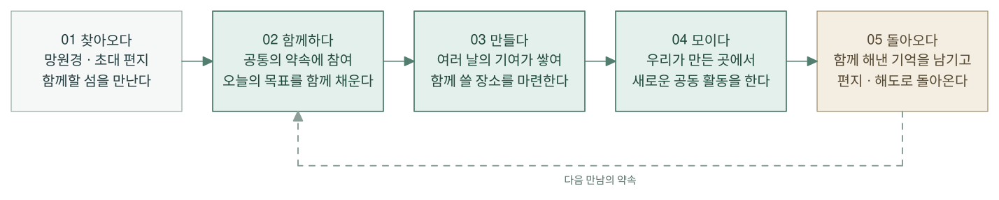
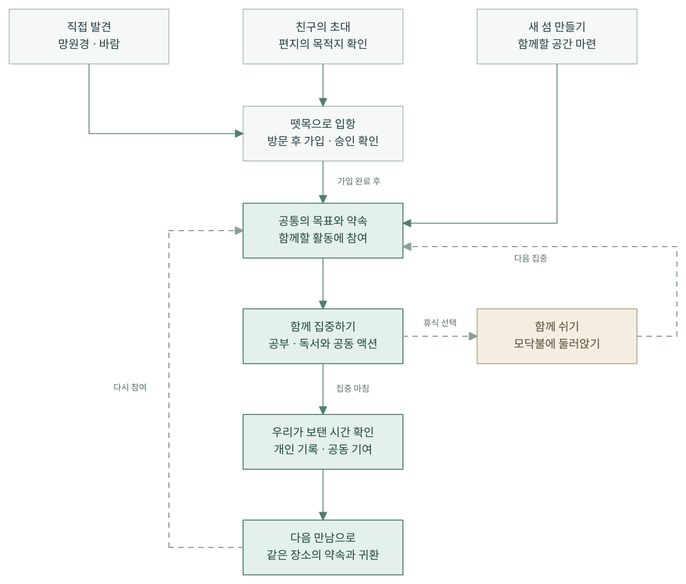

# Catus — 유저 저니

2026.09.10 · 이야기와 기능 표현 기획

> 같이 만든 장소에 다시 모인다.

## 1. 전체 이야기

**첫 발견은 섬으로, 재방문은 우리가 만든 장소로 향한다.** 함께할 일을 약속하고, 서로의 집중을 보태고, 함께 해낸 결과를 확인하는 경험이 중심이다.

| 단계 | 사용자의 마음 | 기능을 감싸는 방식 |
| --- | --- | --- |
| 찾아오다 | “어떤 사람들과 함께할까?” | 망원경·바람으로 발견, 편지로 초대, 뗏목으로 입항 |
| 함께하다 | “오늘 목표, 우리 같이 채워보자.” | 공동 테이블·모닥불에서 같은 약속에 참여 |
| 만들다 | “이 장소, 우리가 같이 만든 거야.” | 여러 날의 기여를 모아 함께 쓸 장소 마련 |
| 모이다 | “우리 부두에서 같이 하자.” | 완성한 장소에 약속을 걸고 공동 활동 |
| 돌아오다 | “오늘도 그 자리에서 만나자.” | 함께한 기록을 남기고 편지·해도로 귀환 |

이것은 매번 거쳐야 하는 순서가 아니다. 장소 만들기는 여러 날에 걸쳐 진행되며, 이미 있는 장소에서도 바로 함께할 수 있다.

[SVG](diagrams/gachisup-user-journey.svg) · [고화질 PNG](diagrams/gachisup-user-journey.png) · [편집본](diagrams/gachisup-user-journey.excalidraw) · [Mermaid 원본](diagrams/gachisup-user-journey.mmd)

## 2. 참여와 재방문의 흐름

실선은 기본 진행, 점선은 선택 가능한 휴식·재참여 경로다. 연한 초록은 함께하는 과정, 모래색은 쉬거나 기억을 남기는 순간을 표시한다.

- **들어오는 길:** 발견·초대·새 섬 만들기를 구분한다. 방문과 가입은 다르며, 가입·승인이 필요한 경우 확인 후 참여한다.
- **함께하는 기준:** 같은 약속에 참여하고 공동 결과에 기여한다. 모든 사람의 시작·종료 시각을 강제로 일치시키지는 않는다.
- **집중과 휴식:** 공부·독서는 실제 기록이며, 그 유형이나 휴식 여부로 같은 모임을 다른 공간에 보내지 않는다. 휴식의 모닥불을 같은 자리의 전환 또는 함께 선택한 이동으로 표현할지는 논의 중이다. 그림의 휴식 분기는 상태의 변화이지 별도 방으로 강제 이동하는 경로가 아니다.
- **장소별 활동:** 낚시는 부두·뗏목에서 하는 공동 활동이다. 기본 낚싯대는 무료이며, 낚시를 기본 휴식으로 두지 않는다. 현실의 집중 유형과 캐릭터 액션은 별도로 기록·표현한다.
- **다시 모일 이유:** 기록은 단순한 시간 합계뿐 아니라 우리가 함께 만든 장소와 그곳에서 한 일로 이어진다.

‘함께 보탠 시간 확인’은 집중을 마친 결과를 나타낸다. 선택한 휴식은 집중 보상에 포함하지 않는다. 취소·가입 거절·중도 종료 같은 예외는 이 큰 흐름에서 생략했으며, 참여는 사용자의 선택이다.

[SVG](diagrams/gachisup-participation-flow.svg) · [고화질 PNG](diagrams/gachisup-participation-flow.png) · [편집본](diagrams/gachisup-participation-flow.excalidraw) · [Mermaid 원본](diagrams/gachisup-participation-flow.mmd)

## 편집과 활용

- [브라우저에서 크게 보기](user-journey.html)
- `.excalidraw` 파일은 [Excalidraw](https://excalidraw.com)에 열어 박스·문구·연결선을 편집할 수 있다.
- `.svg`는 확대해도 선명한 벡터, `.png`는 문서에 바로 넣을 수 있는 2400px 이미지다.
- `.mmd`는 의미와 연결의 원본이다. 각진 최종 배치는 `render-user-journey.cjs`에서 정리하며, 편집본을 오프라인 렌더러로 내보낸다. Mermaid만 별도 렌더링하면 배치가 달라질 수 있다.

이 문서는 기획 방향을 표현한다. 모든 기능의 구현 완료, 보상 수치, 건설 비용, 과금 정책을 확정하지 않는다.

관련 문서: [이야기와 기능 표현 기획](gachisup-story-and-wrapping.md) · [전체 기능 목록](feature-inventory.html)
