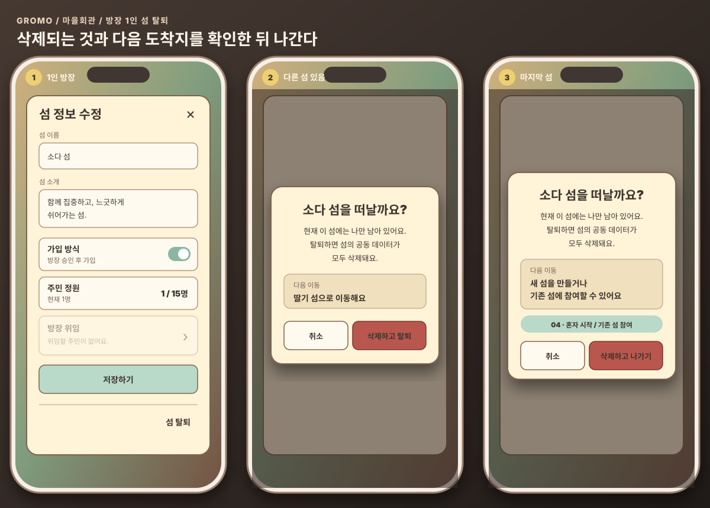

# 현재 정책 · 2026-09-14

이 문서가 현재 유효한 정책이다. 이전 대화에서 대체된 결정은 아래 변경 이력에 분리한다. IA는 화면·기능 구조, 유저저니는 이용 흐름을 담으며 수치·예외 규칙은 이 문서를 따른다. 마을회관의 화면 구조는 [마을회관 모달 명세](specs/town-hall-modal-spec.md), 휴식의 최신 화면·세션 규칙은 [휴식 화면 명세](specs/rest-screen-spec.md)를 함께 따른다.

## 물고기 재화와 기록

- 재화는 물고기 하나이며 섬 소유다. 개인 물고기 지갑은 없다.
- 집중한 섬에만 물고기와 집중 실적이 쌓인다. 복수 소속 섬에 중복 적립하지 않는다.
- 탈퇴자가 모았던 물고기도 섬에 남는다. 단, 방장 1인 섬을 삭제하며 탈퇴하는 경우에는 해당 섬의 공동 물고기 잔액과 원장을 함께 삭제한다.
- 유효 집중 시간 1분(60초)마다 물고기 1마리를 낚는다. 휴식 시간은 유효 집중에서 제외하며, 쉬었다 돌아와도 이미 집중한 시간과 낚은 수는 유지한다.
- 주민 한 명이 한 섬에서 집중으로 낚는 물고기는 하루 최대 480마리(유효 집중 8시간어치)다. 상한에 닿아도 집중 기록은 계속 쌓이고 물고기만 더 낚지 않는다.
- 물고기 잔액과 주민별 누적 획득 기록은 구분한다. 구매·건설로 잔액이 줄어도 누적 획득 기록은 줄이지 않는다.
- 주민별 누적 물고기 획득 기록은 도서관 공사 완료 후 조회한다. 건설 퀘스트의 요구량 달성 확인과 구분한다.

## 인증·게스트 계정

- 계정 상태는 `GUEST`와 `MEMBER`로 구분하고, 로그인 수단은 `APPLE`·`GOOGLE`·`KAKAO`로 별도 관리한다.
- 게스트도 고양이 선택, 섬 만들기·가입, 집중까지 이용할 수 있다. 서버 임시 계정으로 저장해 앱 재실행 후에도 데이터를 유지한다.
- 친구 추가·편지 보내기·상점 구매를 처음 시도할 때 소셜 로그인을 요청한다.
- 게스트가 소셜 로그인으로 전환하면 기존 고양이·섬 소속·집중 기록을 같은 사용자 계정으로 이전한다.
- 로그인 제공자에 따라 기능을 다르게 제한하지 않는다. 회원 계정 하나에는 로그인 수단을 하나만 연결하며 `authProvider=APPLE|GOOGLE|KAKAO` 단일 값으로 저장한다. 게스트의 `authProvider`는 `null`이다.
- 회원 계정에 두 번째 로그인 수단을 추가하지 않는다. 가입 후 로그인 수단 변경·연동 해제도 제공하지 않으며 회원 계정의 `authProvider`는 불변 값이다.
- 같은 이메일만으로 서로 다른 제공자 계정을 자동 병합하지 않는다. 기존 계정과 합칠 때는 명시적인 계정 연동 절차를 사용한다.
- 게스트가 이미 다른 회원 계정에 연결된 Apple·Google·Kakao로 로그인하면 기존 회원 계정을 우선한다. 이때 게스트 데이터는 자동 병합하지 않는다.
- 기존 계정 발견만으로 게스트 데이터를 지우지 않는다. 사용자에게 기존 계정 전환 여부를 안내하고, 명시적으로 확인한 경우에만 기존 회원 계정으로 전환한다. 취소하면 게스트 상태와 데이터는 그대로 유지한다.
- 기존 계정으로 전환을 확정하면 게스트의 고양이·섬 소속·개인 집중 기록은 폐기하고 기존 회원 데이터를 불러온다. 게스트가 집중해서 섬에 이미 적립한 공동 물고기와 섬 공동 거래 기록은 되돌리지 않는다.
- 게스트가 주민이 있는 섬의 방장이면 방장 위임 또는 섬 정리를 끝내기 전 전환을 막는다. 진행 중인 집중 세션도 종료한 뒤 전환한다.
- 로그아웃은 서버 데이터를 유지하고 현재 기기 세션만 종료한다. 회원 탈퇴에서 계정 삭제 절차를 진행한다.

## 건물 퀘스트와 공사

- 최초 회관 → 게시판은 기존 물고기 모으기 방식과 순서를 유지한다.
- 이후 방장이 회관의 다음 건물 선택에서 목표를 정하면 게시판에 건물 건설 퀘스트가 생긴다.
- 도서관·전망대·우체통·축음기 순서는 자유다. 상점은 다른 모든 건물 공사 완료 후 선택한다.
- 한 번에 한 건물만 진행한다. 공사 완료 후 다음 퀘스트를 개방한다. 공사 중에 한 집중은 다음 건물 몫에 들어가지 않는다.
- 게시판 다음 건물은 섬 인원과 상관없이 건물마다 물고기 총액이 고정돼 있다. 대상 주민은 총액을 대상 인원으로 나눈 몫(올림)을 각자 채운다. 사람이 많을수록 각자 몫이 작아져 빨리 짓는다.
- 각자 몫은 목표를 고른 뒤부터 모은 물고기로 판단한다. 기존 보유분과 이전 건물 때 쌓은 기록은 인정하지 않는다. 주민별 누적 획득 기록 자체는 줄이거나 초기화하지 않는다.
- 목표 선택 시점의 주민으로 대상을 고정한다. 목표를 바꾸지 않는 동안 새로 가입한 주민은 그 퀘스트에 추가하지 않는다. 탈퇴하거나 강퇴된 주민은 대상에서 제외한다.
- 방장은 공사 시작 전 목표를 변경할 수 있다. 변경 시점의 현재 주민으로 대상을 다시 정해 신규 주민도 포함한다. 누적 획득 기록은 초기화하지 않는다. 이미 모은 몫을 새 목표로 이어서 셀지는 추가 결정이 필요하다.
- 대상 주민 전원이 각자 몫을 채우고 섬 잔액도 총액 이상이면 완료 도장을 표시한다.
- 일일 퀘스트 보상을 각자 몫에 넣을지는 추가 결정이 필요하다.
- 음원 구매 등으로 잔액이 부족해지면 완료 도장을 지운다. 각자 모은 몫과 달성 기록은 유지하며 부족분만 채우면 도장을 다시 표시한다.
- 방장이 건설하기를 누를 때 필요한 물고기를 섬 잔액에서 차감하고 공사를 시작한다. 요구량 달성·도장 표시 시점에는 차감하지 않는다.
- 차감 후 진행 중인 공사는 해당 비용 차감 때문에 취소되거나 도장 부족 상태로 되돌아가지 않는다.
- 공사 완료 후 건물을 이용한다. 건물 퀘스트는 일일 초기화하지 않는다.

## 건설 수치

|건물|물고기 요구량|공사 시간|
|---|---|---|
|마을회관|섬 통장 합산 60마리|1분|
|게시판|섬 통장 합산 추가 240마리|15분|
|축음기|총액 1,360마리|30분|
|도서관|총액 2,720마리|1시간|
|우체통|총액 4,080마리|1시간 30분|
|전망대|총액 5,440마리|2시간 30분|
|상점|총액 6,800마리|4시간|

마을회관·게시판은 주민별 몫 없이 섬 잔액만 본다. 축음기부터는 대상 주민이 총액 ÷ 대상 인원(올림)을 각자 채우고, 방장이 건설하기를 누를 때 총액을 섬 잔액에서 차감한다. 대상 인원 × 1인당 요구량 공식은 쓰지 않는다. 주민이 하루 2시간 집중하면 상점 완공은 15명 섬 15일차(만 2주)·10명 섬 20일차·5명 섬 38일차·3명 섬 61일차·1명 섬 175일차다(시뮬레이션). 운영 후 조정할 수 있다.

## 일일 퀘스트와 보상

- 집중·스크린타임 퀘스트는 모두 일일 퀘스트다. 다음 날 새 회차가 된다.
- 주민 한 명 달성 시 섬에 물고기 10마리를 지급한다. 달성한 주민에게 보상받기 모달을 띄우고, 그 주민이 받기를 누르면 섬에 적립한다.
- 전원 달성 시 대상 주민 수 × 5마리를 추가 보너스로 지급한다. 보너스는 전원 달성 즉시 섬에 적립하고, 대상 주민 모두에게 축하 모달을 한 번씩 띄운다.
- 같은 회차에서 각 주민의 달성 보상과 전원 보너스는 각각 한 번만 지급한다.
- 5명이 전원 달성하면 개별 달성 50마리 + 보너스 25마리 = 총 75마리가 섬에 적립된다.
- 집중 퀘스트와 스크린타임 퀘스트의 보상은 같다.
- 건설 퀘스트는 추가 물고기 없이 건물 해금 자체가 보상이다.

## 상점·축음기·소유권

- 주민 누구나 섬 물고기로 상점 상품·축음기 음원을 구매할 수 있다.
- 공동 섬·건물 테마도 주민 누구나 적용·해제한다.
- 개인 의상·장신구는 구매한 주민의 보유품이며 탈퇴해도 유지한다. 내 배에서 착용한다.
- 음원은 완공된 축음기에서 직접 구매·재생한다. 상점은 필요하지 않다.
- 같은 섬의 공동 음원은 주민 누구나 변경한다. 기기 음량·음소거는 개인 기기에만 적용한다.
- 강아지는 상점 NPC 전용이다. 사용자 캐릭터는 고양이, 배는 동일한 기본 뗏목이다.
- 공동 음악 장치의 이름은 축음기로 통일한다.

## 집중·휴식·도서관

- 목표 시간 입력 없이 할 일을 입력하고 카운트업으로 집중한다.
- 홈에서 집중하기를 누르면 기본 뗏목을 타고 낚시섬으로 이동한다. 낚시섬과 원래 섬 사이를 오가는 이동 시간은 집중 시간에 넣지 않는다.
- 낚시섬에 도착하면 원하는 곳을 자유롭게 눌러 자리를 잡는다. 앱이 정한 자리 목록이나 자리 번호는 없다. 누른 곳에 집중 준비 모달을 띄우고, 할 일을 입력한 뒤 집중을 시작한다.
- 같은 섬 주민은 같은 낚시섬에서 각자 고른 곳에 앉아 낚시한다.
- 낚시 섬의 뗏목을 누르면 본인만 원래 섬으로 돌아간다. 다른 주민은 함께 이동하지 않는다.
- 내 과목·경과 시간과 다른 주민 이름·과목·경과 시간은 표시 정보로 다룬다. 확대·축소 조작은 독립 IA 노드로 두지 않는다.
- 휴식하기를 누르면 뗏목 이동·부두 도착·걷기 연출을 거쳐 모닥불 전용 화면으로 이동한다. 휴식 시간은 버튼을 누른 순간부터 시작하며 이동 연출도 포함한다. 이 시간에는 유효 집중 시간과 낚시 보상이 늘지 않는다.
- 휴식 화면에서는 나무 의자 없이 고양이가 모닥불 둘레에서 식빵을 굽는다. 고양이 머리 위에는 이번 휴식 경과 시간, 발 아래에는 이름을 표시한다. 누적 집중 시간·낚은 물고기 수·혼자 쉴 때의 별도 안내 문구는 표시하지 않는다.
- 휴식 자리는 서버가 `restSeat`로 빈 최소 번호를 자동 배정한다. 먼저 쉬던 주민의 자리와 타이머는 다른 주민이 들어오거나 나가도 유지한다.
- 휴식 중에는 축음기 음악 변경과 이모티콘 5종만 허용한다. 채팅과 다른 건물 진입은 막는다.
- 휴식 화면의 집중 이어가기를 누르면 낚시섬의 하던 자리로 돌아가 같은 집중을 이어간다.
- 휴식 화면의 휴식 종료하기를 누르면 이번 집중을 끝내고 결과창을 띄운 뒤 섬 화면으로 돌아간다.
- 낚시섬에서 집중 종료를 누르면 결과창을 확인한 뒤 배를 타고 원래 섬으로 돌아온다.
- 집중 종료 후 다른 섬으로 이동한다. 기록·물고기는 집중한 섬에 귀속한다.
- 도서관 완공 후 나와 같은 섬 모든 주민의 집중·스크린타임 기록을 일·주·월 단위로 조회한다.
- 다른 섬 주민도 도서관 기록을 볼 수 있다.
- 공개 범위는 전체 공개 고정이며 사용자 설정은 없다.
- 도서관 완공 전 이전 기록은 조회할 수 없다. 이번 집중 종료 직후 결과 및 퀘스트 결과와는 구분한다.
- 데이터 없음·권한 없음·실제 0은 구분한다.

## 섬 가입·전망대·랭킹

- 섬 생성 시 방장이 가입 방식(승인 필요 또는 승인 불필요)과 정원을 설정한다. 정원은 1~15명이며, 따로 정하지 않으면 15명이다.
- 정원에는 방장을 포함한 현재 주민만 센다. 승인 대기 중인 가입 신청과 NPC는 세지 않는다.
- 정원은 마을회관에서 방장이 수정할 수 있다. 현재 주민 수보다 작게 줄일 수는 없다.
- 주민 수가 정원에 도달하면 즉시 가입과 초대 코드 입장을 막고 정원이 가득 찼다고 안내한다. 가득 찬 섬은 섬 찾기·이름 검색에 표시하지 않고, 초대 코드로 찾으면 섬은 보여 주되 입장만 막는다.
- 승인 필요 섬이 가득 차면 새 가입 신청을 막는다. 승인 대기 중에 가득 차면 신청은 유지하고 승인만 막으며, 방장에게 정원을 늘리도록 안내한다.
- 마지막 한 자리에 동시에 가입하면 한 명만 성공한다.
- 낚시섬은 정원 최대 15명이 함께 앉는 것을 기준으로 하며, 정원을 넘는 인원 표시는 두지 않는다.
- 승인 필요 섬은 해당 섬 방장의 승인을 기다리고, 승인 불필요 섬은 승인 대기 없이 가입한다.
- 승인 대기 중인 가입 신청은 취소할 수 있고, 다시 신청할 수 있다.
- 복수 소속을 허용하며 새 가입만으로 기존 섬에서 탈퇴하지 않는다.
- 모든 사용자는 메인 섬을 하나 가진다. 첫 섬을 만들거나 가입하면 그 섬이 메인 섬이 되고, 내 뗏목의 내 정보에서 내가 속한 섬 중 하나로 바꿀 수 있다.
- 메인 섬에서 탈퇴하거나 강퇴되면 남은 섬 중 가장 최근에 가입한 섬이 메인 섬이 되고 알림을 보낸다.
- 메인 섬 이름은 친구 목록과 친구 프로필에만 표시하고 친구가 아닌 사용자의 검색 결과에는 표시하지 않는다. 메인 섬은 물고기·집중 기록 적립과 랭킹에 영향을 주지 않는다.
- ~~소속된 마지막 섬에서는 탈퇴할 수 없다. 다른 섬에 가입하거나 새 섬을 만든 뒤 탈퇴한다.~~ 2026-09-17 정책으로 대체했다.
- 방장 외에 주민이 있는 섬에서 방장은 바로 탈퇴할 수 없다. 탈퇴를 누르면 방장 위임이 먼저 필요하다는 토스트를 보이고 방장 위임창으로 이동한다.
- 방장 혼자만 남은 섬은 위임할 주민이 없으므로 방장 위임을 비활성화한다. 이 경우에만 파괴적 확인창을 거쳐 섬을 삭제하고 탈퇴할 수 있다.
- 혼자 남은 방장이 다른 섬에도 소속되어 있으면 확인창에 섬 공동 데이터의 완전 삭제와 다음 이동 섬을 함께 알린다. 확인하면 현재 섬을 삭제하고 남아 있는 메인 섬으로 자동 이동한다. 삭제한 섬이 메인 섬이었다면 남은 섬 중 가장 최근에 가입한 섬을 메인 섬으로 지정하고 이동한다.
- 혼자 남은 방장에게 이 섬이 마지막 소속 섬이면 동일한 삭제 안내를 보인다. 확인하면 현재 섬을 삭제하고 `04 · 혼자 시작 / 기존 섬 참여` 화면으로 이동한다. 계정·고양이·닉네임 설정을 다시 하지 않고 섬 선택 단계만 재사용한다.
- 섬을 삭제하면 섬 이름·소개·설정, 공동 물고기 잔액·원장, 건물·건설 퀘스트, 공동 구매·적용 내역, 섬 소속·공동 기록을 함께 삭제한다. 계정, 고양이, 닉네임, 친구, 개인 보유품과 개인 집중 기록은 유지한다.
- 앱을 켜면 마지막으로 접속한 섬에서 시작한다.
- 추가 결정 필요: 소속된 마지막 섬에서 강퇴된 사용자의 처리.
- 전망대는 별도 작은 섬에 있으며 다리로 진입한다. 다른 섬 랭킹·검색·가입을 제공하고 우리 섬 내부 주민 랭킹은 제공하지 않는다.
- 주간 랭킹은 매주 일요일 00시에 초기화한다.
- 평균 = 해당 섬에서 집중한 시간 합계 ÷ 해당 섬 전체 주민 수. 다른 섬에서 집중한 시간은 제외한다.

## 방장 1인 섬 탈퇴 화면

확인창은 삭제되는 범위와 확인 후 도착지를 한 화면에서 보여 준다. 파괴적 확인 버튼은 `삭제하고 탈퇴` 또는 `삭제하고 나가기`로 결과를 명확히 표현한다.

## 친구 관리·우체통 대화

- 친구 검색·추가·목록 관리는 내 뗏목(IA의 내 배)에서 제공한다.
- 친구 요청은 상대가 수락해야 친구 관계가 성립한다.
- 보낸 친구 요청은 수락 전에 취소할 수 있다. 받은 요청은 수락하거나 거절할 수 있다.
- 요청이 거절돼도 바로 다시 신청할 수 있다. 맺어진 친구 관계는 삭제할 수 있다.
- 친구 관계는 섬 소속과 별개이며 서로 다른 섬에 있는 친구와도 대화할 수 있다.
- 우체통에 기존 우리 섬 편지방과 친구에게 보내는 비동기 편지를 함께 제공한다.
- 우리 섬 편지방은 해당 섬 전체 대화, 친구 편지는 선택한 친구의 받은 편지함으로 수신 범위를 구분한다. 실시간 1:1 채팅방은 제공하지 않는다.
- 친구 관리 자체에 우체통 건설 조건을 붙이지 않는다. 우체통 진입은 기존 완공 조건을 유지한다.
- 닉네임은 대소문자를 구분하지 않고 중복될 수 없으며, 만들거나 바꿀 때 앞뒤 공백 없이 저장한다. 친구 검색은 대소문자를 구분하지 않고 닉네임이 정확히 일치할 때만 결과를 보여 준다. 비슷한 닉네임은 보여 주지 않으며 본인과 탈퇴한 사용자는 제외한다.
- 친구 편지는 기록으로 남기지 않는다. 받는 사람이 편지를 열었다가 닫으면 지워진다. 보낸 사람의 보낸 편지 목록에는 상대가 확인하기 전까지만 남고, 확인되면 양쪽에서 모두 사라진다.
- 친구를 삭제하면 서로 편지를 보낼 수 없고, 아직 확인하지 않은 편지도 지운다.
- 받는 친구의 섬에 우체통이 없어도 친구 편지를 보낼 수 있다. 받은 편지는 쌓여 있다가 받는 친구가 속한 섬 중 우체통이 완공된 섬에서 볼 수 있다.
- 차단 기능은 2.0.0에서 제공하지 않는다.

## 남아 있는 구현 세부 기준

- 일일·주간 초기화에 적용할 시간대와 데이터 지연 처리.
- 랭킹 집계 중 가입·탈퇴에 따른 분모 산정 시점.
- 통신 실패·동시 구매·동시 건설 요청의 중복 차감·보상 방지 처리.
- 달성한 주민이 보상받기를 누르지 않은 채 회차가 바뀔 때의 처리.
- 낚시섬에서 다른 주민이 앉아 있는 곳과 겹치게 눌렀을 때의 처리.
- 휴식 인원이 준비된 자리 수를 넘거나 최대 15명까지 늘어날 때의 화면 배치.
- 휴식 중 이모티콘을 active-only 정책과 어떻게 맞출지, 백그라운드·앱 종료 뒤 휴식 시간을 어떻게 복구할지.

이는 위에서 확정한 재화·권한·건설 흐름을 다시 미정으로 돌리는 항목이 아니다.

## 변경 이력

2026-09-16 휴식 화면 결정(GROMO-1862): 휴식을 섬 지도나 모달이 아닌 전용 모닥불 화면으로 분리했다. 나무 의자와 독서 액션을 없애고 고양이 6색의 식빵 굽기 액션을 사용한다. 휴식은 버튼을 누른 순간 시작해 이동 연출을 포함하며, 서버가 빈 최소 `restSeat`를 자동 배정한다. 휴식 중에는 음악 변경·이모티콘·집중 이어가기·휴식 종료만 제공하고 채팅과 다른 건물 진입은 막는다. 집중 이어가기는 낚시섬의 같은 자리·같은 세션으로 돌아가고, 휴식 종료는 결과창 뒤 섬 화면으로 이동하며 귀환 항해를 생략한다.

2026-09-17 마을회관·방장 1인 섬 탈퇴 결정(GROMO-1843): 2026-09-16의 “마지막 섬에서는 탈퇴할 수 없다”는 폐기했다. 주민이 있는 섬의 방장은 방장을 위임한 뒤에만 탈퇴할 수 있다. 방장 혼자만 남은 섬은 방장 위임을 비활성화하고, 탈퇴 확인 시 섬 공동 데이터가 모두 삭제된다는 점과 다음 이동 위치를 알린다. 다른 소속 섬이 있으면 남은 메인 섬으로 자동 이동하고, 이 섬이 마지막이면 섬을 삭제한 뒤 `04 · 혼자 시작 / 기존 섬 참여` 화면으로 이동한다. 계정·고양이·닉네임·친구·개인 보유품·개인 집중 기록은 유지한다.

2026-09-13~14의 대체된 기록은 `_source/archive/before-policy-audit-fix-2026-09-14/정책-결정-2026-09-14.md`에 보존했다. 상점 자유 순서, 중도 가입자 자동 추가, 제출 즉시 차감, 별도 개인/마을 재화, 공동 구매 권한 미정 같은 과거 문장은 현재 정책으로 사용하지 않는다.

2026-09-14 추가 결정: 다른 섬 주민도 도서관 기록을 볼 수 있다. 가입 신청은 취소하고 다시 신청할 수 있다. 정원은 섬 생성 시 방장이 지정하고 마을회관에서 수정한다. 강퇴된 주민도 건물 퀘스트 대상에서 제외한다. 집중 5분마다 물고기 1마리를 확정하고, 작은 낚시 섬 안을 유지한다.

이전 주제별 정책·검토 문서(건물 해금 퀘스트, 기획 수정 검토, IA 전체 재검토, 유저저니 검토사항, 도서관·전망대·집중·앱 설정 정책, 집중 화면 명세, 낚시 화면 확대·축소, 퀘스트 포스트잇, 캐릭터 정책, 작은 낚시 섬·기본 뗏목 확정, 에셋 폴더 정리안, 04·07 원문)와 검증 기록은 `legacy/`에 보관했다. 현재 정책으로 사용하지 않는다.

2026-09-14 소셜 확장: 우체통의 섬 전체 편지방에 친구 비동기 편지(받은 편지·보낸 편지·읽음 상태)를 추가했다. 친구 검색·추가·관리는 내 뗏목으로 배치하고, 다른 섬 친구에게도 편지를 보낼 수 있다. 실시간 1:1 채팅은 제공하지 않는다.

2026-09-14 친구 관계 결정: 상대 수락으로 관계 성립, 친구 삭제, 보낸 요청 취소, 받은 요청 거절 및 거절 후 재신청을 허용한다.

2026-09-14 저녁 집중·보상 결정: 집중은 부두가 아니라 낚시섬에서 각자 원하는 곳을 눌러 자리를 잡는 방식으로 바꿨다(정해진 자리 목록 없음). 휴식은 원래 섬 모닥불에서 하고, 집중 이어가기는 낚시섬의 하던 자리로 돌아가며, 휴식 종료하기는 집중 종료 → 결과창 → 섬 화면 순서로 진행한다. 정원은 최대 15명이다. 일일 퀘스트 개인 보상은 보상받기 모달로 받고, 전원 달성 보너스는 즉시 지급하며 모든 대상 주민에게 축하 모달을 한 번 띄운다. 공동 음악 장치 이름은 축음기로 통일했다. 이전 작은 낚시 섬 부두 안은 현재 정책으로 사용하지 않는다.

2026-09-15 인증 결정: 게스트는 고양이 선택·섬·집중까지 이용하고 친구 추가·편지·상점 구매에서 소셜 로그인을 요구한다. Apple·Google·Kakao를 지원하되 회원 계정 하나에는 로그인 수단 하나만 연결한다. 미연결 소셜 계정이면 게스트 데이터를 이전한다. 이미 연결된 소셜 계정이면 기존 회원 데이터를 우선하고 명시적 확인 후 게스트 데이터를 폐기한다. 계정 상태와 로그인 제공자는 별도 값으로 저장하고 이메일만으로 자동 병합하지 않는다.

2026-09-15 로그인 수단 불변 결정: 회원 계정은 가입·게스트 전환 때 선택한 Apple·Google·Kakao 한 가지로 계속 로그인한다. 두 번째 수단 추가, 로그인 수단 변경, 연동 해제는 제공하지 않는다.

2026-09-15 정원 결정(GROMO-1831): 정원은 1~15명이며 생성 시 따로 정하지 않으면 15명이다. 방장을 포함한 현재 주민만 세고 승인 대기 신청과 NPC는 세지 않는다. 현재 주민 수보다 작게 줄일 수 없다. 가득 찬 섬은 즉시 가입·초대 코드 입장·새 가입 신청을 막고, 대기 중인 신청은 승인할 때 정원을 다시 확인한다. 낚시섬 수용 기준은 정원과 같은 15명이며, 이전 부두 약 10마리 기준은 사용하지 않는다.

2026-09-15 보상 결정(GROMO-1830): 물고기는 유효 집중 1분(60초)마다 1마리로 바꾸고, 건설 요구량과 일일 퀘스트 보상도 같은 비율(5배)로 환산했다. 건물을 짓는 속도는 이전과 같다. 일일 퀘스트는 1명 달성 10마리, 전원 달성 보너스는 대상 주민 수 × 5마리이며 집중·스크린타임 퀘스트의 보상은 같다. 주민 한 명이 한 섬에서 하루에 낚는 물고기는 최대 480마리(유효 집중 8시간어치)다. 상점 상품·음원 가격은 여전히 미정이다.

2026-09-15 건설 결정(GROMO-1829): 마을회관 60마리·공사 1분, 게시판 추가 240마리·공사 15분은 섬 통장 합산으로 모은다. 게시판 다음 건물은 섬 인원과 상관없는 고정 총액(축음기 1,360·도서관 2,720·우체통 4,080·전망대 5,440·상점 6,800마리)이며, 대상 주민이 총액 ÷ 인원(올림)을 목표를 고른 뒤부터 각자 채운다. 사람이 많을수록 빨리 짓고, 활동하지 않는 주민은 방장이 강퇴로 관리하는 것을 전제로 한다. 공사 시간은 축음기 30분·도서관 1시간·우체통 1시간 30분·전망대 2시간 30분·상점 4시간이다. 대상 인원 × 1인당 요구량 공식과 기존 누적 획득 인정 규칙은 폐지했다. 목표 변경 시 모은 몫을 이어서 셀지와 일일 퀘스트 보상을 몫에 넣을지는 추가 결정이 필요하다.

2026-09-16 친구 편지·메인 섬 결정(GROMO-1867): 닉네임은 대소문자를 구분하지 않고 중복될 수 없으며 앞뒤 공백 없이 저장하고, 친구 검색은 닉네임이 정확히 일치할 때만 보여 준다. 친구 편지는 기록으로 남기지 않고 받는 사람이 열었다가 닫으면 지워지며, 보낸 사람 목록에는 상대가 확인하기 전까지만 남는다. 친구를 삭제하면 서로 편지를 보낼 수 없고 확인하지 않은 편지도 지운다. 받는 친구의 섬에 우체통이 없어도 편지를 보낼 수 있고, 받은 편지는 받는 친구가 속한 섬 중 우체통이 완공된 섬에서 볼 수 있다. 거절된 친구 요청은 바로 다시 신청할 수 있다. 차단 기능은 2.0.0에서 제공하지 않는다. 모든 사용자는 메인 섬을 하나 가지며 첫 섬이 메인 섬이 되고 내 뗏목의 내 정보에서 바꾼다. 메인 섬에서 나가거나 강퇴되면 가장 최근에 가입한 남은 섬이 메인 섬이 된다. 메인 섬 이름은 친구 목록·친구 프로필에만 표시하고 적립·랭킹에는 영향이 없다. 마지막 섬에서는 탈퇴할 수 없고, 앱은 마지막으로 접속한 섬에서 시작한다. 마지막 섬에서 강퇴된 사용자의 처리는 추가 결정이 필요하다.
